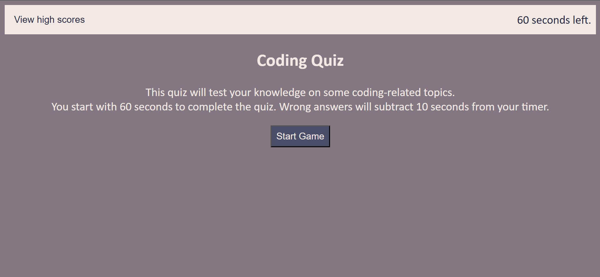
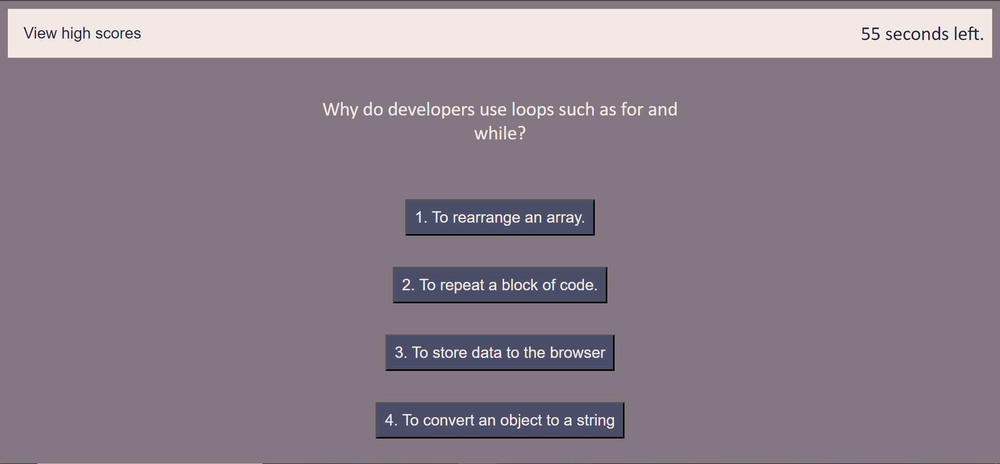
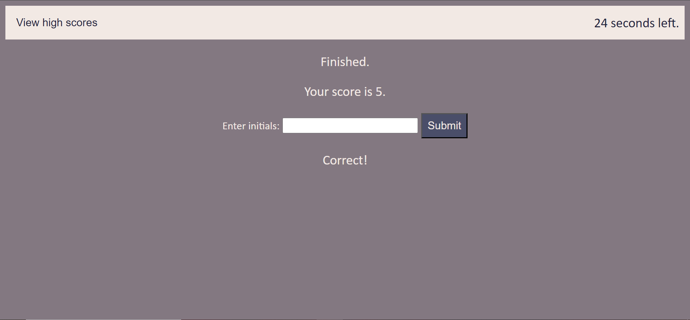
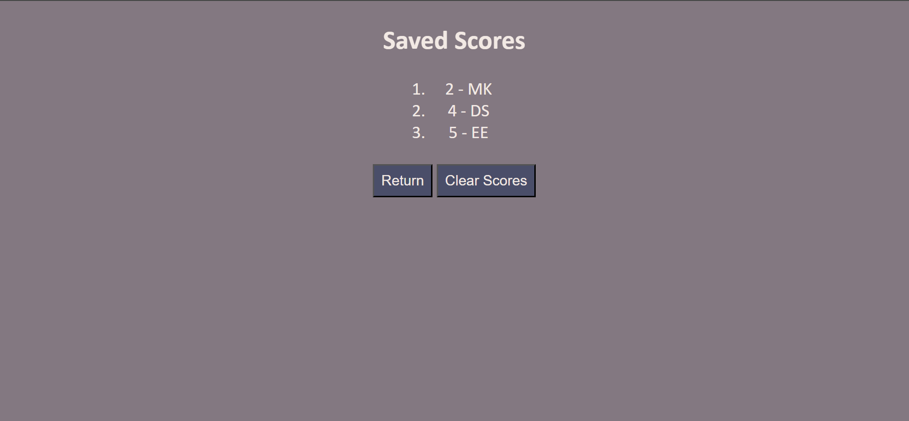

# Code-Quiz

## Description

This application is a timed quiz on coding-related topics, namely JavaScript topics. Users can click the start button to begin the quiz, click on the answers to progress, and enter their initials at the end to submit and save their score. On the high scores page, users can review saved scores as well as reset the saved score data to start with a blank list again.

The purpose of this application is to help learners of JavaScript test their knowledge in a time-sensitive setting. This quiz also serves to simulate coding assessments that employers might expect potential employees to take as part of an interview process. Taking this coding quiz can help users practice taking these types of coding assessments so they feel more at ease and confident when they are assessed in a real working environment in the future.

Making this website helped familiarize me with the process of creating a fuctional quiz application from scratch. I was able to understand how one must keep the function of JavaScript in mind while writing the HTML outline of the site so it can later be easily integrated with the JavaScript code. Regarding the JavaScript, I learned a lot about using toggle functions to change the display of website content, assessing a clicked element for certain values (in this case, whether the answer was correct or incorrect), and tracking, storing, and recalling score data so it could be displayed on the high scores list.

## Installation

N/A

## Usage

To view this webpage, enter the URL [https://eaeidsath.github.io/Code-Quiz/](https://eaeidsath.github.io/Code-Quiz/) into any browser.

To begin the quiz, press the "Start Game" button. You start with 60 seconds to finish the quiz.

Read the question and select your answer by clicking on the corresponding button. Whether your answer was correct or incorrect will be displayed on the next screen, underneath the answers.

If you select an incorrect answer to a question, 10 seconds will be subtracted from the timer. 

Once all questions have been answered, or if the timer hits zero before all the questions have been answered, the quiz will end and you will be brought to the score submission screen. Input your initials and click submit to save your score and view the high scores list.

Aside from submitting a score, users can see the high scores list by clicking on the "View high scores" button on the upper left side of the screen.

On the high scores list, click the "Clear Scores" button to clear all saved scores from browser storage. Click the "Return" button to return to the start screen of the quiz.

### Screenshots

## Credits

Evelyn Eidsath [https://github.com/eaeidsath](https://github.com/eaeidsath)

Quiz questions 2 through 5: [https://www.w3schools.com/quiztest/quiztest.asp?qtest=JS](https://www.w3schools.com/quiztest/quiztest.asp?qtest=JS)

Tutorials:

Source referenced for how to define question variables, call questions, and assess correct and incorrect answers (script.js lines 17-52, 71-88, 99-109, 115-127): [https://www.geeksforgeeks.org/how-to-create-a-simple-javascript-quiz/](https://www.geeksforgeeks.org/how-to-create-a-simple-javascript-quiz/)

Source referenced for how to add toggle to change element display (script.js lines 56-60): [https://youtu.be/FwLMz7jMRac?si=Zr8Ad6cma3Mhnauw](https://youtu.be/FwLMz7jMRac?si=Zr8Ad6cma3Mhnauw)

Source referenced for rendering, storing, and initializing values with localStorage (script.js lines 162-185): [https://git.bootcampcontent.com/University-of-California---Berkeley/UCB-VIRT-FSF-PT-10-2023-U-LOLC/-/blob/main/04-Web-APIs/01-Activities/26-Stu_Local-Storage-Todos/Solved/assets/js/script.js](https://git.bootcampcontent.com/University-of-California---Berkeley/UCB-VIRT-FSF-PT-10-2023-U-LOLC/-/blob/main/04-Web-APIs/01-Activities/26-Stu_Local-Storage-Todos/Solved/assets/js/script.js)